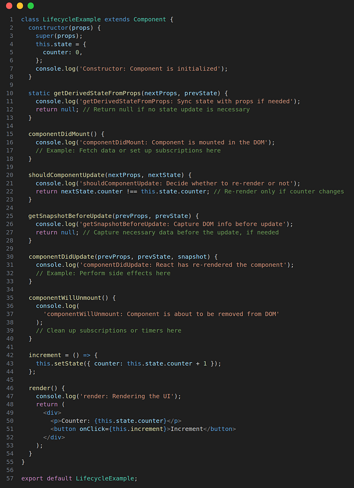
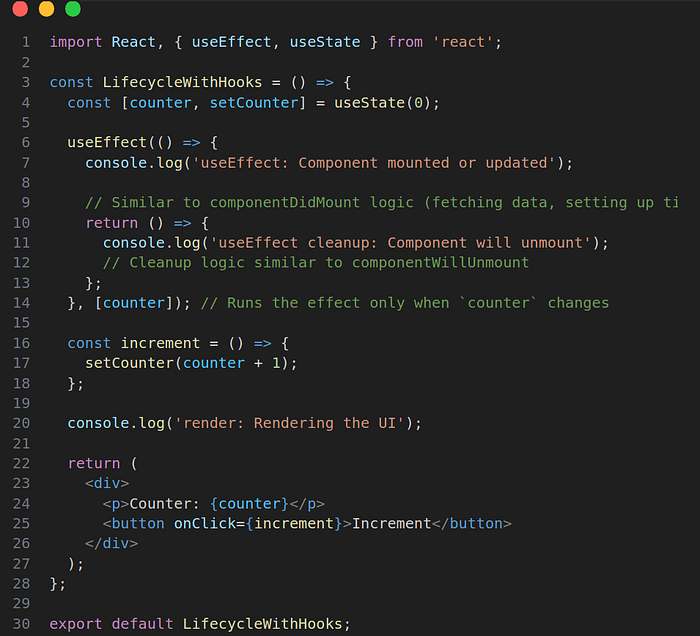
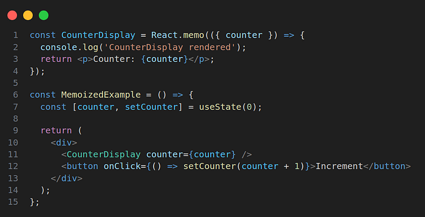
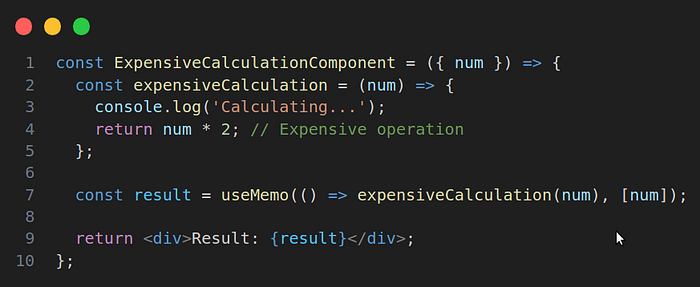
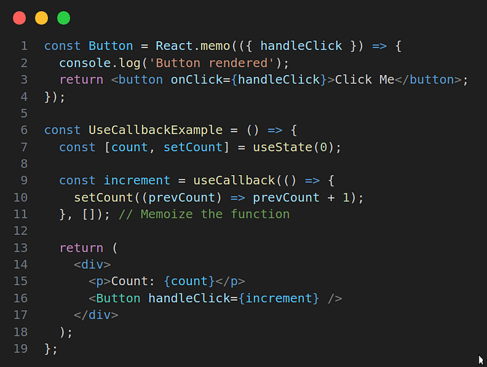
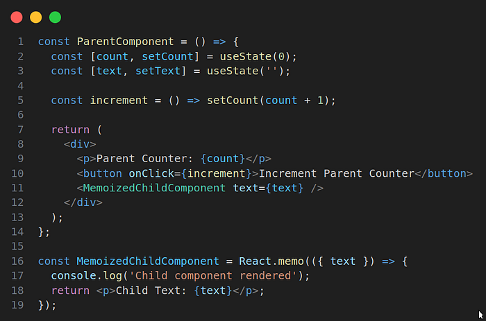

# 📘 Functional Components VS Class Components

In the world of React, components are the fundamental building blocks of your UI. Over time, React has evolved from primarily using class components to a more functional approach with the introduction of React Hooks. While hooks have become the standard for managing state and lifecycle events in functional components, it's important to understand both approaches — class components and functional components.

In this comprehensive guide, we'll dive deep into the differences, provide practical examples, and explain how to manage component state, lifecycle, and performance in both class and functional components. Whether you are new to React or want to solidify your understanding, this guide will help you master both component types.

# 1. Class Components in React: A Deep Dive into Lifecycle Methods

Class components are the original way to manage state and lifecycle events in React. They rely on class-based syntax, which includes methods that React automatically calls during different stages of the component's lifecycle.

# Lifecycle Methods Overview

Each class component in React goes through a set of predictable stages: mounting, updating, and unmounting. Lifecycle methods give you more control during these phases, allowing you to execute specific code at each step.

# Example: A Simple Counter Using Class Components



# Key Lifecycle Methods:

**constructor(props):** Initializes the component state and binds methods.
**getDerivedStateFromProps(nextProps, prevState):** Syncs state with props if necessary.
**componentDidMount():** Called once, after the component is inserted into the DOM.
**shouldComponentUpdate(nextProps, nextState):** Decides whether the component should re-render (useful for optimization).
**getSnapshotBeforeUpdate(prevProps, prevState):** Captures information (e.g., scroll position) before the DOM updates.
**componentDidUpdate(prevProps, prevState, snapshot):** Called after every re-render, used to perform side effects.
**componentWillUnmount():** Cleanup logic when the component is about to be removed.

# Key Observations:

**Boilerplate:** Class components require more boilerplate code, such as constructors and this bindings.
**Lifecycle Control:** The lifecycle methods offer explicit control over how and when components should update or clean up.

# 2. Functional Components in React with Hooks: A Modern Approach

With the introduction of React Hooks, functional components have become the preferred method for managing state, lifecycle events, and side effects. Hooks like useState and useEffect allow you to handle these aspects with simpler, more readable syntax.

# Hooks Overview:

**useState():** Manages state in functional components.
**useEffect():** Handles side effects, including data fetching, subscriptions, and cleanup.

# Example: The Same Counter Using Functional Components and Hooks



Key Observations:

**useState:** Replaces this.state and setState from class components, providing a simpler, more functional way to manage state.

**useEffect:** Combines the functionality of componentDidMount, componentDidUpdate, and componentWillUnmount in one hook. The optional dependency array ([counter]) ensures that effects run only when necessary.

# 3. Performance Optimization with React Hooks

Managing component updates efficiently is key to optimizing performance. React provides several hooks and tools to minimize unnecessary re-renders, especially when dealing with large or complex components.

**React.memo: Prevents re-renders if props haven't changed.**



In this example, _CounterDisplay_ will only re-render when the counter prop changes, reducing unnecessary re-renders.

# useMemo: Memoizes expensive calculations, running them only when necessary.



useMemo ensures that expensiveCalculation only runs when num changes, avoiding expensive recalculations on every render.

**useCallback: Memoizes functions to prevent unnecessary re-creation.**



useCallback ensures that the increment function doesn't get re-created on every render, improving performance.

**4. Handling Updates and Re-renders: Best Practices**
Handling state updates and re-renders efficiently is crucial to maintaining performance, especially in large applications. Here are some best practices:

**Use Functional Updates in useState:**

When the new state depends on the previous state, use the functional form of useState:

```jsx
setCount((prevCount) => prevCount + 1); //ensure correct state updates)
```

**Avoid Deeply Nested State Objects:**
Deeply nested state can lead to complex state management. Instead, try to flatten the state or split it into smaller, manageable pieces.

**Minimize State in Parent Components:**
Passing down state from parent components can cause excessive re-renders. Consider moving state closer to where it's needed, or use the Context API or a state management library like Redux to share state across components.

**React.memo and shouldComponentUpdate:**
Use React.memo for functional components and shouldComponentUpdate for class components to optimize re-renders. However, avoid overusing these optimizations unless necessary.

**Example: Minimizing Re-renders with React.memo**



In this example, MemoizedChildComponent will only re-render if the text prop changes, even if the parent component re-renders when count changes.

# Conclusion

**Class Components** offer explicit lifecycle methods that give fine-grained control over the rendering process, but they tend to have more boilerplate code.

**Functional Components** with React Hooks provide a cleaner and more flexible way to manage state, side effects, and performance optimizations.

**Performance Optimizations** such as React.memo, useMemo, and useCallback help prevent unnecessary re-renders, but they should be used thoughtfully to avoid overcomplicating your code.

In modern React development, functional components with hooks are the preferred approach, thanks to their simplicity and power. However, it's essential to understand class components since you might encounter them in legacy codebases.

Keep experimenting with both approaches, and apply performance optimizations when needed to make your applications fast and efficient!

# Q & A Section (Interview Style)

**Q1: What is the main difference between Functional and Class components?**
A1: Functional components are functions that return JSX.
Class components are ES6 classes that extend React.Component and use a render() method.

**Q2: Can functional components have state?**
A2: Yes, since React 16.8, functional components can use Hooks like useState and useEffect for state and lifecycle.

**Q3: Which one is recommended today?**
A3: Functional components with Hooks are recommended because they are simpler, shorter, and more powerful.

**Q4: How do you handle lifecycle in class vs functional components?**
A4:

- Class ➝ lifecycle methods (componentDidMount, componentDidUpdate, etc.).
- Functional ➝ Hooks (useEffect).

**Q5: Are class components still supported?**
A5: Yes, they are fully supported, but new code usually uses functional components.

**Q6: Why did React introduce Hooks?**
A6: To make functional components capable of handling state and side effects,
reducing the need for class components and making code more reusable.

**Q7: Example: How would you create a counter in both?**
A7:

- Functional: useState Hook for state.
- Class: use this.state and this.setState().

**Q8: Which is easier for beginners?**
A8: Functional components are easier to learn and write because they look like simple JavaScript functions.
