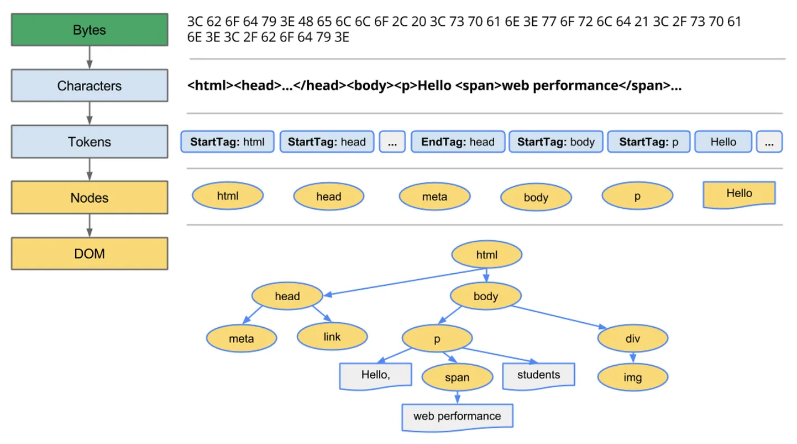
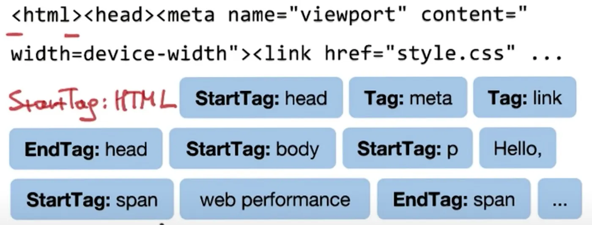
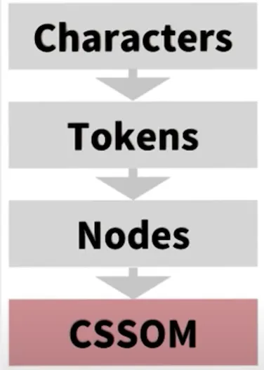
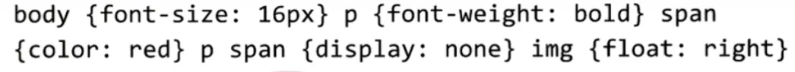
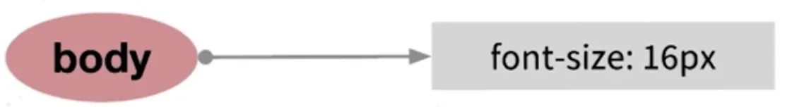
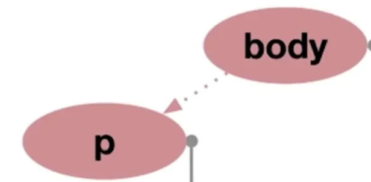
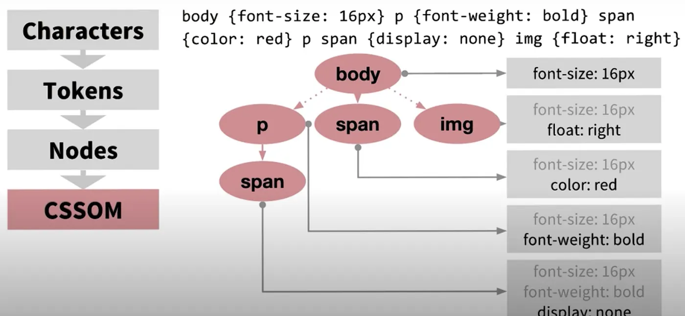
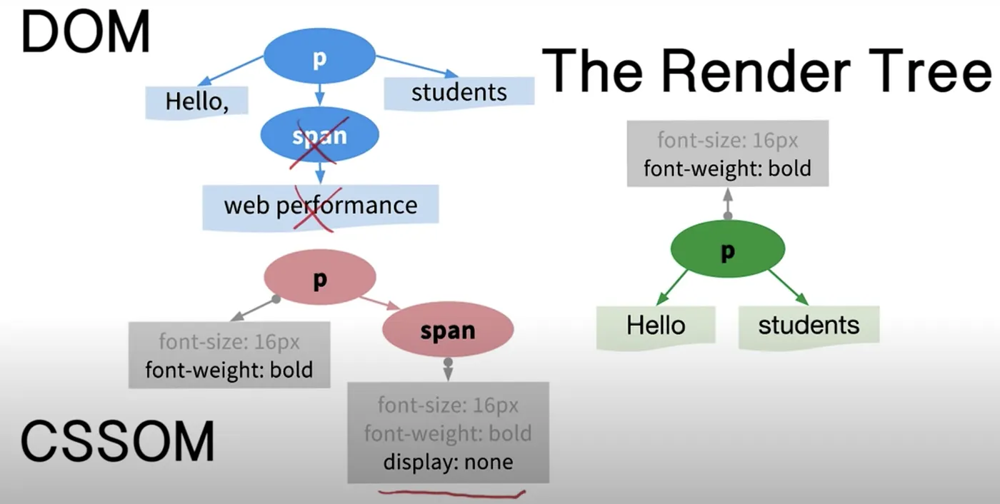
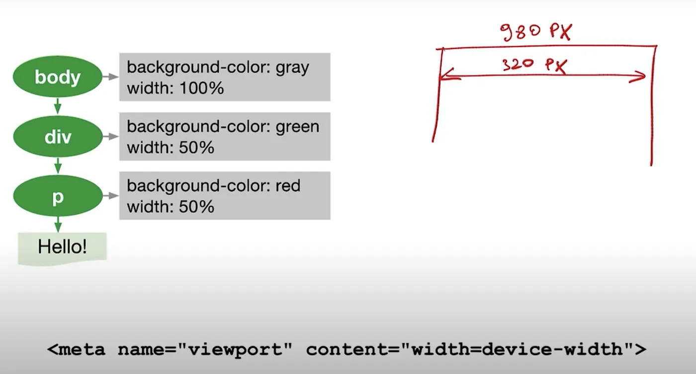
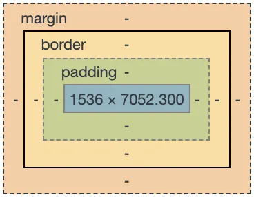

# Understanding DOM, CSSOM, Render Tree, Layout, and Painting.

**Critical Rendering Path Process**

- The DOM and CSSOM trees are combined to form the render tree.
- Render tree contains only the nodes required to render the page.
- Layout computes the exact position and size of each object.
- The last step is paint, which takes in the final render tree and renders the pixels to the screen.

_Optimizing the critical rendering path is the process of minimizing the total amount of time spent performing steps 1 through 4 in the above sequence_.

I think It’s really helpful to know how the browser works under the hood if you want to do performance optimization. So for that, we need to understand what is **Critical render path, how it works the DOM & CSSOM, what is the Render Tree, Layout, and Paint.** So let’s jump to learn how these things are related to web performance.

# How DOM is created?

— When a user hits the URL in the browser, a request is sent to the server and after that, the browser received the marker called HTML. That HTML it’s just text, so to convert that text to DOM, it’s needed to perform a set of following rules:

First, parse the bytes received from the server and generate characters, who are in charge to perform that process is called Tokenizer.

Press enter or click to view image in full size

The **Tokenizing** starts to parse each Start Tags and the End tags and convert to Nodes until it will end up creating the entire Document Objects Models(DOM). The DOM is the full representation of the HTML markers, each individual Node contains all the properties related and needed to represent it.

NOTE: The conversions are well defined in the HTML specifications. Also if you want to look a more detail, please take a look [here](https://web.dev/articles/critical-rendering-path/constructing-the-object-model#document-object-model-dom) .

# How CSSOM is created?

The CSS Object model creation it’s generated like the DOM but with some differences. Let’s see in details in the following screen:

As you see the browser, after reading the characters need to identify the corrects tokens. As you see here there not < > tokens that indicate where start or finalize each token as we have on the DOM. For that, CSS has its own set of rules to identify who should parse that text.

As you see the browser, after reading the characters need to identify the corrects tokens. As you see here there not < > tokens that indicate where start or finalize each token as we have on the DOM. For that, CSS has its own set of rules to identify who should parse that text.

If you want more detail about it, please check [here](https://web.dev/articles/critical-rendering-path/constructing-the-object-model#document-object-model-dom).

First, the browser will start to parse the body tag:

Then, found the p tag, and as the specification mentioned, the body will contain all the nodes, so the browser recognizes that relationship.

And then keep parsing all CSS tags and finally end to construct all the CSS object model (CSSOM) like it shows the following images:

The last, but not least, actually really important to know it’s CSS is render-blocking. That means the browser blocks page rendering until receive and process all CSS of the page. The reason why it happens is that CSS overrides it, so if you, for example, will allow partial rendering, with partial CSS, you will end up with an inconsistent state of the view until finish to process all CSS of the page.

# Render Tree

Once we have all CSSOM and DOM already loaded, we will generate with the Render tree with the only visible nodes related. For instance, the nodes which contain display:none they will not be part of Render Tree.

As you see, we combined DOM and CSSOM and will generate the Green circle nodes as a Render TREE. Only the p will be part of render Tree, the span will not be included in Render Tree because their display:none CSSOM related. Other common DOM nodes that don’t belong to Render tree are the head, metaand linktags because there is nothing visible information to display there to show.

# Layout

The layout (also called reflow) peace will be in charge to calculate the positions and dimensions of each node on the screen. For instance, if you rotate your phone, or if you resize your browser, the layout peace will be executed. let’s take a look another example related to layout:

In the left side, we have our Render Tree (with Green nodes), and at the bottom, we have the meta tag needed to indicate to the browser that that 100% means the pixels of the device, in this example 320px. If we don’t define that meta tag, the browser will define by default 980px that will cause the unwanted zoom in the browser from mobile devices.

# Paint

Finally, now that we know which nodes are visible, and their computed styles and geometry, we can pass this information to the final stage, which converts each node in the render tree to actual pixels on the screen. This step is often referred to as “painting”, “rasterizing.” or “repainting”.

NOTE: if you need to know which property of CSS trigger repaint or reflow, please take a look [here](https://csstriggers.com/).
