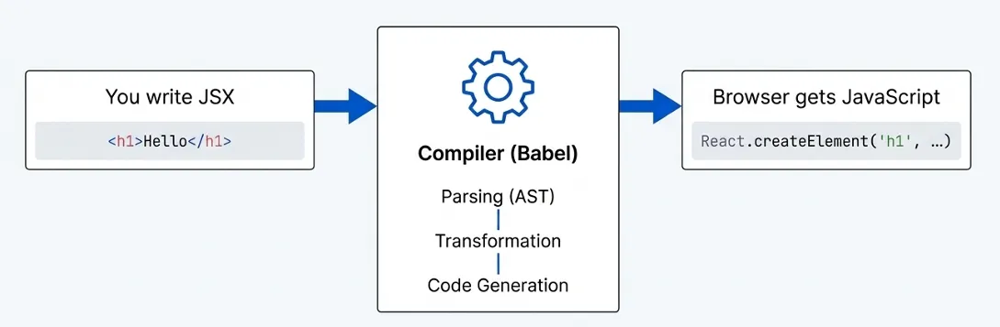
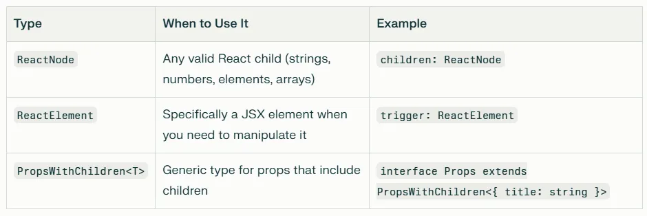

# JSX & Babel Transpilation – Notes

**JSX (JavaScript XML)** is a syntax extension for JavaScript used in React.
Browsers do not understand JSX directly, so Babel transpiles JSX into
React.createElement() calls.

If you’re learning React, you’ve probably written JSX and thought, “This looks like HTML inside JavaScript!” But here’s the truth that will change how you think about React: **JSX is not HTML. It’s syntactic sugar** — a more convenient way to write something else entirely.

**What Really Happens to Your JSX**

When you write JSX code, browsers never actually see it. They can’t understand JSX syntax at all.
Instead, **a compiler (usually Babel)** transforms your **JSX into plain JavaScript** before your code runs.

**Here’s a simple example. When you write this component:**

```jsx
function Greeting({ name }) {
  return <h1 className="greeting">Hello {name}!</h1>;
}
```

Babel compiles it to this JavaScript (using the old pre-React 17 transform):

```jsx
function Greeting({ name }) {
  return React.createElement(
    "h1",
    { className: "greeting" },
    "Hello ",
    name,
    "!",
  );
}
```

The compilation happens in three stages:



**Parsing:** Babel reads your JSX and builds an Abstract Syntax Tree (AST) — a structured representation of your code
**Transformation:** Babel applies plugins that rewrite the tree structure
**Code Generation:** Babel produces JavaScript from the transformed tree

This is why the old transform required you to import React in every file with JSX, even if you never explicitly used it. Every JSX element became a React.createElement() call, so React had to be in scope.

# The Modern Way: React 17’s New Transform

React 17 introduced a better approach that fixes this quirk. Instead of calling **React.createElement**(), Babel now automatically imports special functions from **react/jsx-runtime:**

```jsx
import { jsx as _jsx } from "react/jsx-runtime";

function Greeting({ name }) {
  return _jsx("h1", { className: "greeting", children: "Hello " + name + "!" });
}
```

Notice what’s different: React is no longer imported. The \_jsx function is brought in automatically by Babel. You only need to import React if you actually use React APIs like Hooks.

**This change gives you three benefits:**

- You can write JSX without importing React
- The compiled code is slightly smaller
- It enables future improvements to React’s design

To use the new transform, configure Babel with **"runtime": "automatic"** in your _.babelrc or babel.config.js._

# Understanding React.createElement()

So what exactly is this React.createElement() function that powers JSX? Its signature looks like this:

```jsx
createElement(type, props, ...children);
```

**Each parameter has a specific purpose:**

**type:** Either a string for HTML elements like 'div' or 'h1', or a React component (function or class)
**props:** An object containing attributes, or null if there are none
**children:** Zero or more child elements, passed as additional arguments
The function returns a React element object structured like this:

```jsx
{
  type: 'h1',
  props: { className: 'greeting', children: 'Hello Jane!' },
  key: null,
  ref: null
}
```

Here’s the critical part: creating this object doesn’t render anything to the DOM. It’s just a description — an instruction telling React what you want to display. React uses these objects to figure out what to render and update.

**Why JSX Looks Like HTML But Acts Differently**

JSX intentionally mimics HTML syntax to feel familiar, but there are important differences that reveal its true nature.

**Reserved Words Create Conflicts**

JavaScript has reserved words that clash with HTML attributes. That’s why JSX uses _className_ instead of _class_ and _htmlFor_ instead of _for_. These aren't arbitrary choices—they map to JavaScript object properties, which can't use reserved words.

**Styles Are Objects, Not Strings**

In HTML, the style attribute is a _string_. In JSX, it's a JavaScript object with camelCased properties:​

```jsx
// ❌ Wrong - not valid JavaScript
<button style="color: red; font-size: 1.25rem">Click</button>

// ✅ Correct - valid JavaScript object
<button style={{ color: 'red', fontSize: '1.25rem' }}>Click</button>
```

This makes sense when you remember that JSX compiles to JavaScript. The _style prop_ becomes an object property, which must be a valid JavaScript expression.

**Whitespace Works Differently**

JSX handles whitespace differently than HTML. Whitespace at line boundaries gets stripped, and multiple spaced lines collapse to single spaces:

```jsx
// All three render identically
<div>Hello <strong>world</strong></div>

<div>
  Hello <strong>world</strong>
</div>

<div>
Hello<strong>world</strong></div>
```

If you need intentional spacing, you must add explicit text nodes.

**Built-in XSS Protection**

JSX escapes content by default, which protects you from security vulnerabilities:

```js
// ❌ Renders literally as the text "<h1>Title</h1>"
const html = "<h1>Title</h1>";
<div>{html}</div>;

// ✅ Renders as an actual heading
const title = "Title";
<div>
  <h1>{title}</h1>
</div>;
```

**Common Mistakes and How to Avoid Them**

**Adjacent Elements Need Wrapping**

You can’t return multiple JSX elements directly:

```jsx
// ❌ Error: Adjacent JSX elements must be wrapped
return (
  <Header />
  <Main />
  <Footer />
)

// ✅ Use a Fragment wrapper
return (
  <>
    <Header />
    <Main />
    <Footer />
  </>
)
```

This makes sense when you understand the compilation — you’re trying to return multiple function calls, which is invalid JavaScript syntax. The Fragment (<>) compiles to _React.Fragment_, creating one parent with multiple children.

**Objects Can’t Be Rendered Directly**

Trying to render a plain object causes an error:

```jsx
// ❌ Error: Objects are not valid as React children
const user = { name: 'Alice', age: 30 };
<div>{user}</div>

// ✅ Render specific properties
<div>{user.name}, age {user.age}</div>
```

**The && Operator Can Surprise You**

The && operator for conditional rendering can produce unexpected results. When the left side is falsy, JavaScript returns that falsy value instead of null:

```jsx
// ❌ Renders "0" when count is 0
{
  count && <Counter value={count} />;
}

// ✅ Convert to boolean explicitly
{
  Boolean(count) && <Counter value={count} />;
}

// Or use a ternary
{
  count ? <Counter value={count} /> : null;
}
```

**Dynamic Lists Need Stable Keys**

Using array indices as keys causes problems with reconciliation, especially in React’s concurrent features:

```jsx
// ❌ Index as key breaks with reordering
items.map((item, index) => <Item key={index} {...item} />);

// ✅ Use stable, unique identifiers
items.map((item) => <Item key={item.id} {...item} />);
```

**TypeScript: Choosing the Right Type**

If you’re using TypeScript, there are three main types for handling children:



Use _ReactNode_ for the _children_ prop in most cases. Use _ReactElement_ when your component needs to clone or manipulate elements:

```jsx
interface ModalProps {
  trigger: ReactElement;  // Need to clone this
  children: ReactNode;    // Just render as-is
}

function Modal({ trigger, children }: ModalProps) {
  const triggerWithClick = cloneElement(trigger, { onClick: () => {} });
  return <div>{triggerWithClick}{children}</div>;
}
```

**Practical Implications for Your Code**

Understanding that JSX is syntactic sugar for function calls explains several design decisions:

**Build Tools Are Required**

Unlike plain JavaScript, JSX requires compilation. You can’t use JSX directly in browsers without a build step. This is why projects avoiding build complexity sometimes use React.createElement() directly

**Performance Considerations**
Inline arrow functions in JSX create new function instances on every render:

```jsx
// ❌ Creates new function each render
<button onClick={() => alert("clicked")}>Click</button>;

// ✅ Define outside or use useCallback
const handleClick = () => alert("clicked");
<button onClick={handleClick}>Click</button>;
```

This matters because React uses reference equality for dependency arrays and memoization

**Other Frameworks Can Use JSX**

Libraries like Vue and Preact can support JSX by implementing their own _jsx_ function. JSX isn't exclusive to React—it's a general syntax that any framework can adopt.

**When to Use React.createElement() Directly**

In most projects, JSX is the better choice.
But there are rare cases where you might use React.createElement() directly:

- Projects without build infrastructure (though this is increasingly uncommon)
- Generating components dynamically where JSX syntax won’t work
- Specific library integrations requiring explicit function calls
- Educational purposes to understand React fundamentals

For production code, stick with JSX for better readability while producing identical compiled output.

**Key Takeaways**

Here’s what you need to remember:

**JSX is not HTML** — it’s syntactic sugar for **React.createElement()** function calls
**Browsers never see JSX** — compilers transform it to JavaScript before execution
**JSX compiles to objects** — these objects describe your UI, they don’t directly render anything
**Syntax differences have reasons** — className, style objects, and other quirks exist because JSX must be valid JavaScript
**Understanding compilation explains patterns** — why Fragments exist, why adjacent elements fail, and why certain approaches work better

Mastering this mental model transforms JSX from a set of confusing syntax rules into logical implications of its true nature. You’ll debug faster, write more idiomatic code, and understand why React works the way it does.

Next time you write JSX, remember: you’re not writing HTML. You’re writing JavaScript function calls with a friendly syntax. And that distinction makes all the difference.

**Quick Recap (Mind Map)**

JSX escapes content by default, which protects you from security vulnerabilities:

JSX → Babel → React.createElement → React element (JS object)
→ React DOM → Actual DOM update

✅ JSX is just syntactic sugar for React.createElement.
✅ React.createElement returns a plain JS object (React element).
✅ React DOM uses reconciliation to update the real DOM efficiently.

# ❓ Q & A Section (Interview Style)

**Q1: What is JSX?**
A1: JSX is a syntax extension for JavaScript, used in React to describe UI.
It looks like HTML but compiles to React.createElement().

**Q2: Why do we need Babel for JSX?**
A2: Browsers don’t understand JSX directly. Babel transpiles JSX into
React.createElement() calls which browsers can run as plain JS.

**Q3: What does React.createElement() return?**
A3: It returns a plain JavaScript object (called a React element), which
represents a virtual DOM node.

**Q4: What is the signature of React.createElement()?**
A4: React.createElement(type, props, ...children)

**Q5: What is the difference between JSX and React.createElement?**
A5: JSX is syntactic sugar, easier to read/write.
React.createElement is what JSX compiles to behind the scenes.

**Q6: Is JSX mandatory in React?**

A6: No. You can use React without JSX by writing React.createElement()
directly, but JSX makes code much more readable.

**Q7: How does nested JSX translate into React.createElement calls?**
A7: Nested JSX creates nested React.createElement() calls.

```js
//Example:
<div><h1>Hello</h1></div>
➝ React.createElement("div", null, React.createElement("h1", null, "Hello"))
```

**Q8: When JSX is transpiled, what kind of structure do we get?**
A8: A tree of JavaScript objects (React elements) which React uses in
reconciliation to update the real DOM.
