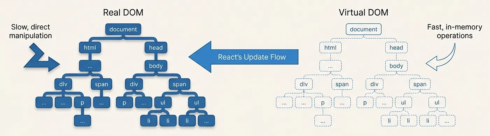
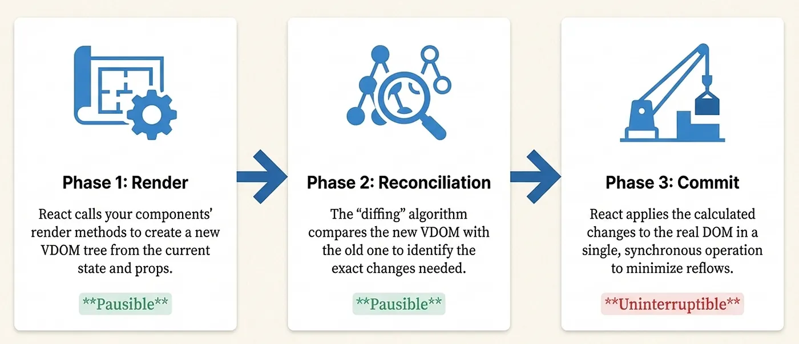
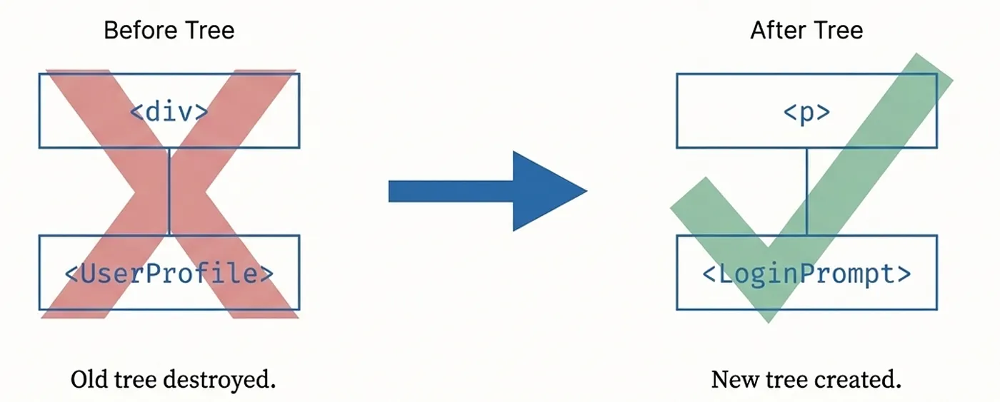
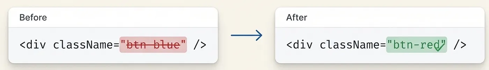
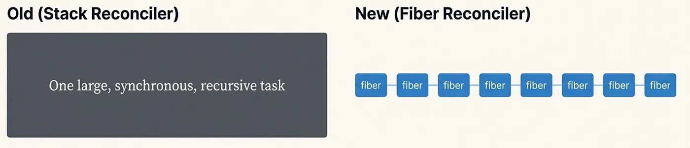
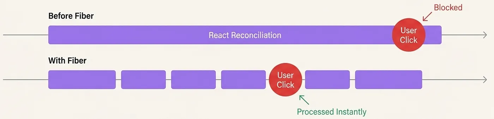
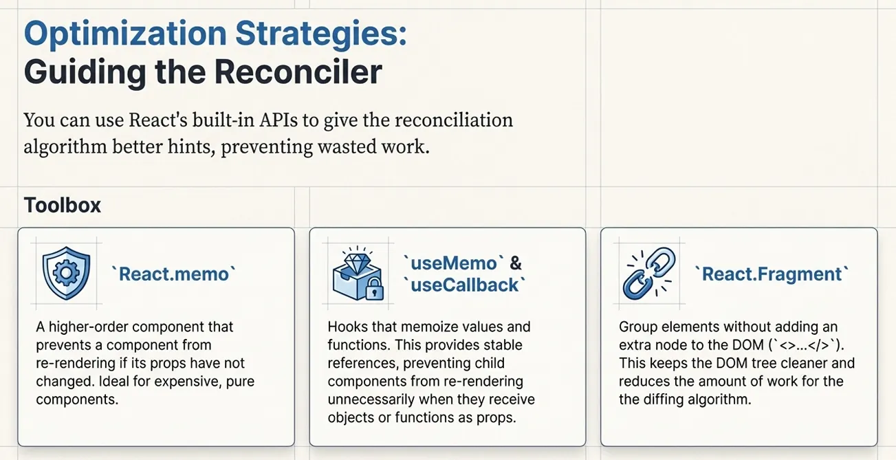

# React Reconciliation Explained: How the Diffing Algorithm Makes your app fast

If you’ve been working with React, you’ve probably heard terms like “Virtual DOM,” “reconciliation,” and “diffing” thrown around. These aren’t just buzzwords — they’re the fundamental mechanisms that make React fast and efficient. Let’s break down these concepts in a way that’s easy to understand and directly applicable to your everyday React development.​

**What Are Virtual DOM, Diffing, and Reconciliation?**

React maintains a lightweight, in-memory copy of the actual DOM called the **Virtual DOM**. When your component’s state or props change, React doesn’t immediately update the real DOM. Instead, it follows a smart three-step process:​



First, React creates a new Virtual DOM tree representing what the UI should look like. Then, it compares this new tree with the previous one through a process called diffing to identify what changed. Finally, through reconciliation, React applies only those specific changes to the actual DOM.​

Think of it this way: diffing is the detective work (finding differences), while reconciliation is the action (applying those differences to the real DOM). They work together to ensure your UI updates efficiently without re-rendering everything.​

**The Three-Phase Update Cycle**e
When you update state in React, three distinct phases occur:

**Render Phase:** React calls your component functions and constructs a new Virtual DOM tree. This phase calculates which components need updates and can be paused if a high-priority user interaction occurs.​

**Reconciliation Phase:** React compares the new Virtual DOM with the previous one using its diffing algorithm to determine the minimal set of changes needed. This phase is also pausable and can be interrupted without affecting the user experience.​

**Commit Phase:** Once reconciliation is complete, React applies all calculated changes to the actual DOM in one batch. This phase is synchronous and cannot be interrupted, which minimizes expensive DOM operations.​



**The Diffing Algorithm: How React Stays Fast**

Here’s an interesting fact: optimal tree-diffing algorithms have O(n³) complexity. For 1,000 elements, that would mean around a billion comparisons! React avoids this by using a heuristic O(n) algorithm based on two key assumptions.

**Heuristic 1: Different Element Types = Different Trees**

When React encounters two elements with different types `(like changing from <div> to <span> or from <Article> to <Comment>)`, it completely tears down the old tree and rebuilds from scratch. Rather than trying to find subtle similarities between different element types, React assumes they're fundamentally different and replaces them entirely. This trade-off sacrifices perfect optimization for speed.​



**Heuristic 2: Same Types Get Compared**
When two elements have the same type, React keeps the underlying DOM node and only updates the attributes that changed. For example:​

```jsx
// Before
<div className="before" title="stuff" />

// After
<div className="after" title="stuff" />
```

React recognizes both are div elements, keeps the same DOM node, updates only the className attribute, and then recursively compares their children using the same rules



**Keys: The Third Critical Heuristic**

When rendering lists, React faces a challenge: how does it identify which child is which when positions might change? This is where the key prop becomes essential.​

Without keys, React compares children by their position in the array. If you reorder, insert, or remove items, React might incorrectly reuse DOM nodes and component instances. This can cause unexpected state to persist on the wrong items, form inputs to maintain values on shifted items, and unnecessary component remounting.​

With stable, unique keys, React can track individual items across renders, even when their positions change. Keys act as a contract: you promise that the key uniquely identifies an item throughout the list’s lifetime.​

```jsx
// ✅ Good - using database IDs as keys
<ul>
  {items.map(item => <li key={item.id}>{item.name}</li>)}
</ul>

// ❌ Bad - using array indices (causes issues when list reorders)
<ul>
  {items.map((item, index) => <li key={index}>{item.name}</li>)}
</ul>
```

**React Fiber: The Modern Architecture**



Introduced in React 16, Fiber is a complete architectural redesign that breaks down reconciliation work into smaller units. Fiber introduced two critical improvements:​

**Incremental Rendering:** Instead of blocking the entire browser thread during reconciliation, Fiber breaks work into smaller chunks. React can pause reconciliation if the user interacts with the UI, resume work later, and prioritize certain updates over others.​

**Improved Reconciliation:** The fiber-based algorithm uses a singly-linked list structure that can be traversed and interrupted, replacing the old recursive approach that created the entire tree at once.



**Performance Optimization Strategies**

Understanding reconciliation enables several optimization techniques:​

**React.memo:** Prevents re-renders when props haven’t changed, saving the entire reconciliation process for that component
**useMemo and useCallback:** Preserve object and function references across renders, helping React’s diffing algorithm recognize unchanged values
**Proper Keys:** Use stable, unique identifiers from your data instead of array indices
**Avoid Inline Functions:** Define functions outside render methods to prevent creating new function references on every render
**Break Down Large Components:** Smaller component trees are quicker to reconcile and result in better performance
Press enter or click to view image in full size



**Why This Matters for Your Code**

React’s reconciliation algorithm is what makes the framework practical for real-world applications. By understanding how diffing works, you can write code that aligns with React’s assumptions, avoiding patterns that trigger unnecessary full-tree comparisons or component remounting.​

The trade-off React makes — using heuristic O(n) diffing instead of optimal O(n³) algorithms — is what enables React to handle dynamic, interactive UIs efficiently. When you follow React’s principles around keys, stable component types, and awareness of position-based identity, you leverage years of optimization work and ensure your applications perform well as they scale.​

Understanding these concepts will help you debug mysterious state management issues, optimize slow components, and make better architectural decisions in your React applications.
