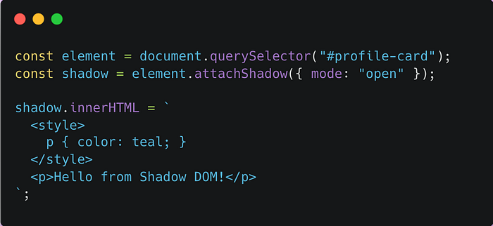

# What Is the Shadow DOM?

The **Shadow DOM** is a browser feature that lets you attach a hidden, isolated DOM tree to an element…**a private scope that doesn't leak styles or markup into the rest of the page.**

It's one of the core building blocks of Web Components, enabling truly reusable, self-contained UI elements.

**Why the Shadow DOM Exists ???**
Without it, components would constantly fight with:

- global CSS overrides
- unexpected style inheritance
- naming collisions
- layout or script side effects

Shadow DOM creates a boundary so your component's internal structure and styles stay fully encapsulated.

# Basic Example

**Inside this shadow tree:**

- styles apply only to elements in the shadow root
- external CSS cannot override them (unless using CSS parts or custom properties)

**Two Modes**

- open → shadow root is accessible via JS (element.shadowRoot)
- closed → completely hidden from JS

**Why It Matters ?**

Shadow DOM gives developers:

- style encapsulation
- predictable component behavior
- reusable UI that doesn't break on host pages
- foundation for modern design systems

Frameworks like React/Vue don't use it by default, but Web Components, design systems, and browser UIs heavily rely on it
