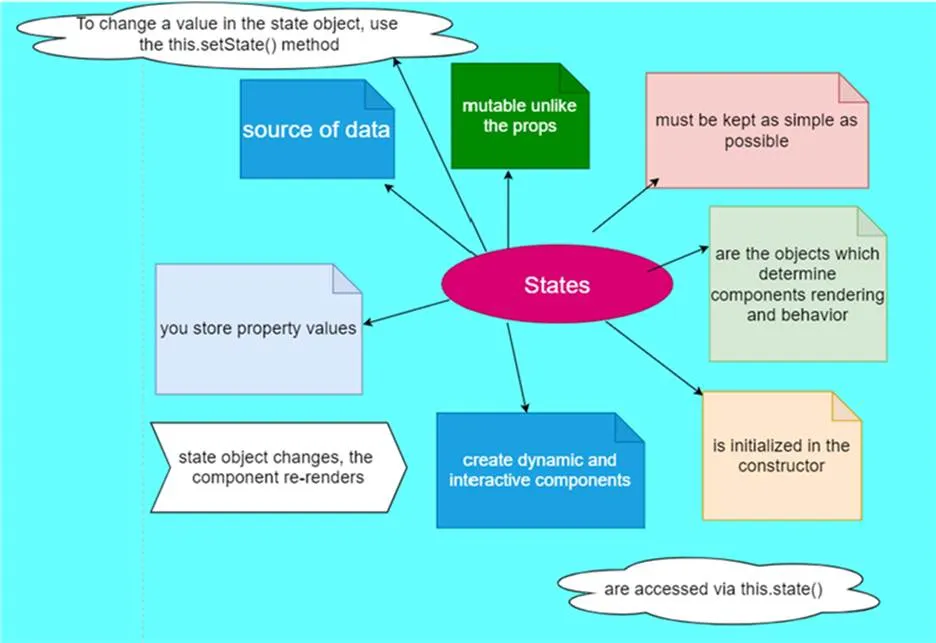

# State vs Props

In React, props (short for properties) are used to pass data from a parent component to its child components. Props are immutable, meaning they cannot be changed by the child components. They are a way of communicating information between components and can be used to customize the behavior and appearance of child components based on the data provided by the parent component.

Here are some key points about props in React:

**1. Passing Props:**

- Props are passed from a parent component to a child component as attributes.
- Example usage: <ChildComponent propName={propValue} />

**2. Reading Props:**

- Props can be accessed in the child component using the props object.

- Example usage: const propValue = props.propName;

**3. Functional Components:**

- In functional components, props are received as the first parameter of the component function.
- Example usage: function ChildComponent(props) { /_ Access props _/ }

**4. Class Components:**

- In class components, props can be accessed through the this.props object.
- Example usage: class ChildComponent extends React.Component { /_ Access props using this.props _/ }

**5. Prop Types:**

- Prop types are used to define the expected type and requiredness of props.
- They can help catch bugs and provide better documentation for component usage.
- Prop types can be defined using the prop-types library or the static propTypes property in class components.

**6. Default Props:**

- Default props can be defined to provide fallback values for props that are not explicitly passed.
- They ensure that the component can still function correctly even if certain props are not provided. 7.

**Immutable Nature:**

- Props are read-only and cannot be modified by the child component.
- If a child component needs to modify the data, it should be done by raising events/callbacks to the parent component.

**8. Prop Drilling:**

- Prop drilling refers to the process of passing props through multiple intermediate components to reach a deeply nested child component.
- It can make the code harder to maintain and understand.
- In such cases, you can use techniques like React Context or state management libraries to avoid prop drilling.

# State

In React, state is a built-in feature that allows components to manage and store data that can change over time. It represents the current state of the component and influences the rendering of the component and its behavior. State is an internal data container that can only be directly accessed and modified by the component itself.

**Here are some key points about state in React:**

**1. Declaring State:**

- State is declared within a component using the useState hook (for functional components) or as a property of the component class (for class components).
- Example usage in functional components: const [state, setState] = useState(initialState); 2.

**2. Initializing State:**

- State is typically initialized with an initial value that reflects the component’s starting state.
- In functional components, the useState hook is used to set the initial state.
- In class components, the constructor method is often used to initialize the state.

**3. Accessing State:**

- State can be accessed using the state variable created by the useState hook or by referencing this.state in class components.
- Example usage in functional components: const value = state;
- Example usage in class components: const value = this.state.key;

**4. Updating State:**

- State should not be modified directly. Instead, the setState function (for functional components) or this.setState method (for class components) is used to update the state.
- State updates are typically triggered by events or asynchronous operations.
- Example usage in functional components: setState(newValue);
- Example usage in class components: this.setState({ key: newValue });

**5. Asynchronous Updates:**

- State updates in React are asynchronous, meaning that multiple updates may be batched together for performance reasons.
- If you need to perform an operation based on the latest state, you can pass a function to setState or this.setState.
- Example usage: setState(prevState => prevState + 1);

**6. Rendering and Reacting to State Changes:**

- When state changes, React re-renders the component and its child components to reflect the updated state.
- You can define the rendering logic based on the current state using conditional rendering and expressions within JSX.

**7. State Management:**

For complex applications, managing state can become challenging. In such cases, you can use state management libraries like Redux or MobX.

State plays a crucial role in React applications by allowing components to manage and update data dynamically. It enables components to be responsive to user interactions, external events, and data changes, leading to a more interactive and dynamic user interface.

Link to read=>

https://freedium-mirror.cfd/https://javascript.plainenglish.io/mastering-react-state-props-through-real-world-scenarios-and-optimization-techniques-ebd979ba497b

https://freedium-mirror.cfd/https://medium.com/@sanjeevanibhandari3/why-react-needs-you-to-use-setstate-49305547b500
