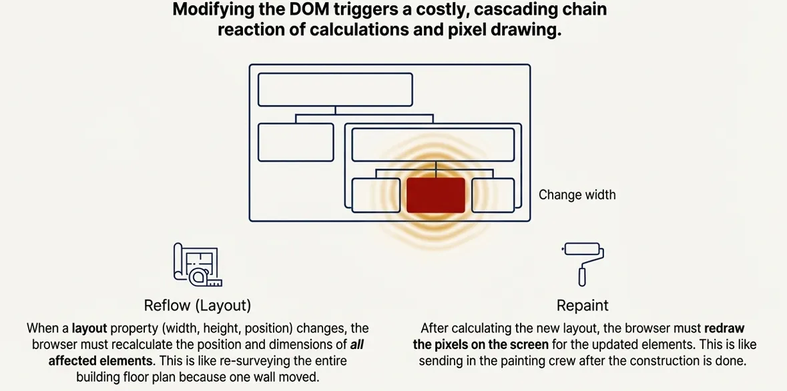
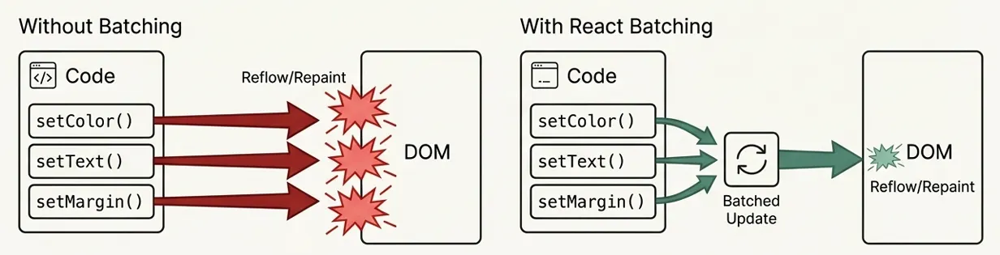
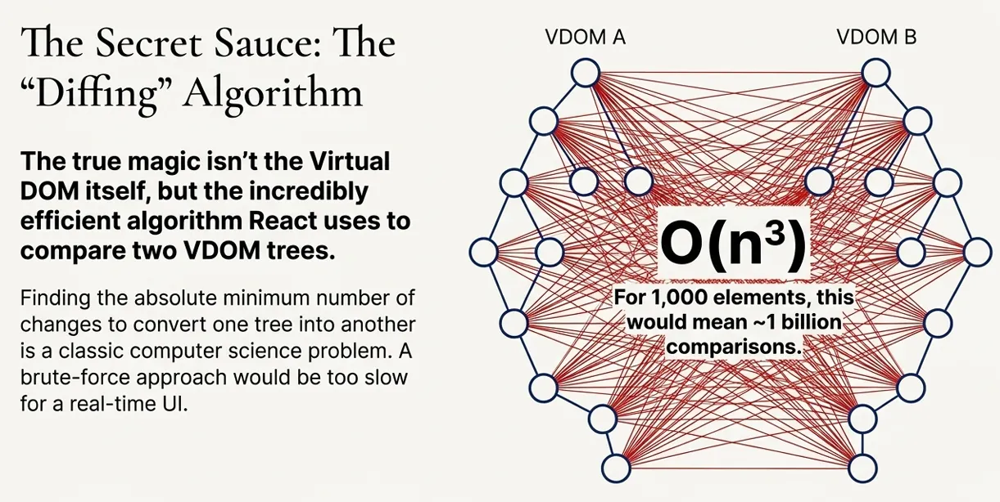
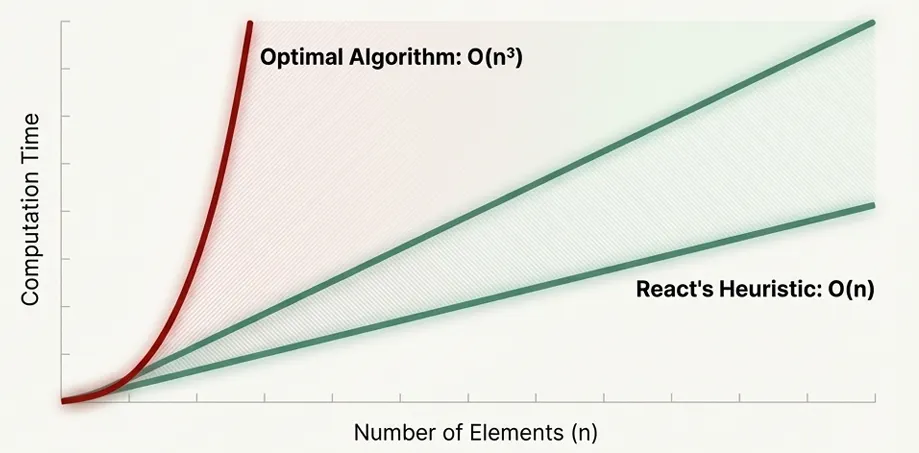
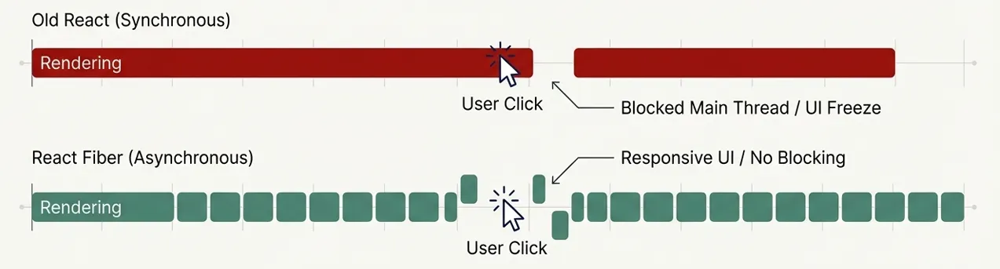
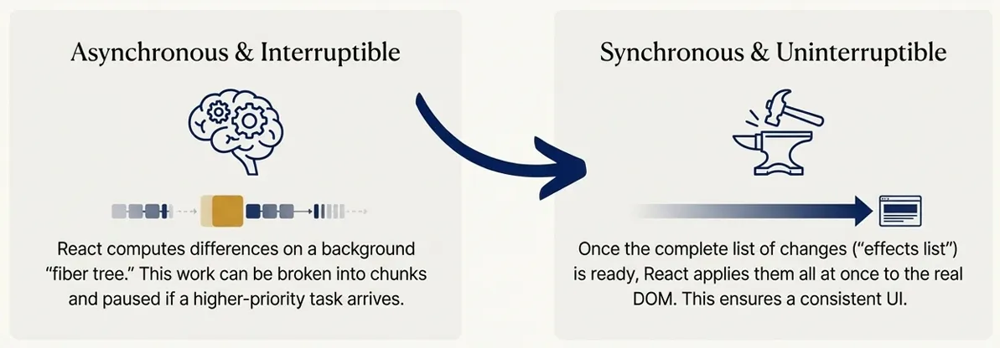
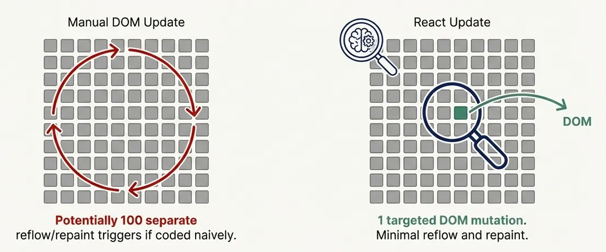
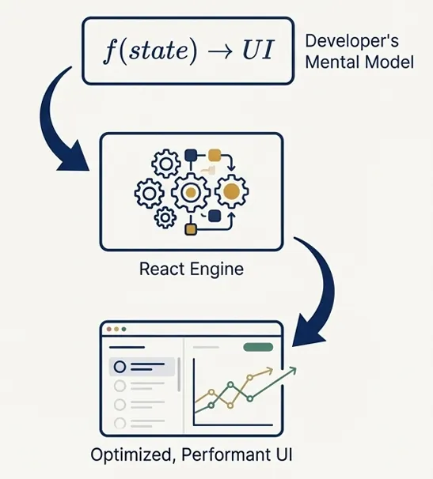
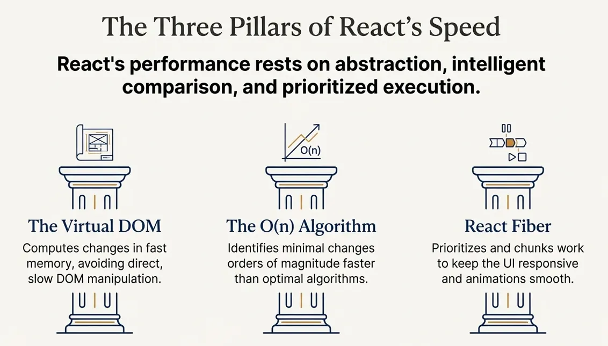

# 📘 Virtual DOM vs Real DOM vs Shadow DOM – Notes (Easy Explanation)

These are three different "DOM" concepts you will often hear about in web development.
React mainly uses the Virtual DOM, browsers have the Real DOM, and Web Components use Shadow DOM.

# Real DOM

The Real DOM is the actual tree of elements that the browser creates
from your HTML. Changing it directly is slow because even small changes
can force the browser to update a lot of elements.

React feels fast not because it “magically” speeds up the browser, but because it carefully avoids doing slow work on the real DOM and instead does most computations in memory first. The Virtual DOM, React’s diffing algorithm, and the Fiber architecture all work together so that only the smallest, most necessary updates ever reach the browser.​

**Why the DOM Is a Bottleneck**

Before talking about the Virtual DOM, it helps to understand why the browser’s real DOM is expensive to work with.​

When you change the DOM, the browser often must:

**Reflow (layout):** Recalculate the size and position of affected elements, sometimes cascading through large parts of the page.
**Repaint:** Redraw pixels when visual properties like color or background change.



Reflow is especially costly because one change can force the browser to recompute layout for many nodes, and repaint usually follows reflow, creating a double hit. Frequent, small DOM changes — like updating items inside loops one by one — can cause many reflows and repaints, making pages sluggish and animations janky.​

**Imperative vs Declarative UI**
Traditional DOM code is imperative: you specify step by step how to update the UI (select an element, change its style, insert children, etc.). Writing this in a highly optimized way — batching DOM writes, minimizing layout thrashing, and ordering reads and writes carefully — is hard and error-prone.​

React encourages a declarative style: you describe what the UI should look like for a given state, and React figures out how to update the DOM efficiently. This shift lets developers focus on state and structure while React centralizes the performance tricks that are otherwise scattered through imperative code.​

**What the Virtual DOM Actually Is**

The **Virtual DOM** is a lightweight, in-memory tree of JavaScript objects that mirrors the structure of the browser DOM. Instead of mutating the real DOM immediately on every state change, React updates this Virtual DOM first.​


A typical render cycle looks like this:​

**Initial render:** React builds a Virtual DOM tree representing the UI and then uses it to create the real DOM once.

**State or props change:** React builds a new Virtual DOM tree for the updated UI instead of touching the real DOM directly.

**Diffing:** React compares the new Virtual DOM with the previous one to find what changed.

**Commit:** React applies only those minimal changes to the real DOM, in batches, to reduce reflows and repaints.​

Because all the diffing and calculation happen in memory, they are much faster than direct DOM operations, which trigger layout and paint work in the browser.​


**Batching: Fewer DOM Updates, Fewer Reflows**

React also batches updates: multiple state changes are grouped into a single render and commit rather than causing separate DOM operations each time.​

For example, if a component updates the text, color, and margin of an element during one event, React treats these as one render cycle and produces one optimized DOM update. This approach is aligned with best practices for browser performance: fewer, larger DOM updates are cheaper than many tiny ones, because they trigger fewer reflows and repaints.​



**The Diffing Algorithm: Fast by Design**

Comparing two trees in the most optimal way is a classic hard problem. A fully general tree diff can take O(n³) time in the worst case, which is far too slow for interactive UIs. Even more practical algorithms that aim for “optimal” diffs often end up O(n²), which still does not scale well for large component trees updated many times per secon



React avoids these costs with a heuristic diffing algorithm designed for how real UIs behave.​

**The Core Heuristics**

React’s diffing strategy relies on two key assumptions:​

**Different element types create different subtrees:** If a node changes from, say, a `<div> to a <span> `, React discards the old subtree and builds a new one.
**Stable keys identify stable children:** When rendering lists, developers provide a key prop so React can match items across renders and reuse existing DOM nodes instead of destroying and recreating them.​

With these assumptions, React can perform reconciliation in **approximately O(n) time**, where n is the number of elements at a given level. This trades theoretical optimality for predictable, linear-time performance that works well for typical UI patterns.​



**Level-by-Level Comparison**

React compares trees **level by level**, matching children in order and by key rather than trying to find the best possible mapping across different levels. When it sees a different type at the same position, it stops trying to reconcile that subtree and replaces it, which is cheaper than exploring many possible mappings.​

This approach may sometimes perform more DOM updates than a mathematically optimal algorithm, but it makes the computation fast enough to run on every render without blocking the UI.​

**Fiber: Keeping the UI Responsive**

React 16 introduced **Fiber**, a new reconciliation engine that focuses on scheduling and prioritization. Earlier versions of React ran reconciliation synchronously: once an update started, React would walk the whole tree recursively before yielding back to the browser. Large updates could block the main thread, delaying user input handling and causing visible jank.​

Fiber breaks work into **small units** (fiber nodes) so React can:

- Pause work partway through a render.
- Abandon low-priority work if something more urgent arrives (like a keystroke).
- Resume work later from where it left off.



The process is conceptually split into two phases:

**Render phase:** React builds a new fiber tree and calculates changes in memory; this phase can be interrupted or spread across multiple frames.

**Commit phase:** React applies the collected changes to the DOM in one synchronous, atomic step, ensuring the UI updates consistently.

Fiber also maintains an effects list — a linear list of nodes that actually need side effects such as DOM changes — so the commit phase can skip nodes that did not change and apply only necessary updates. This reduces the cost of committing updates in large trees.



The result is that high-priority interactions stay snappy even when the application is doing a lot of rendering work behind the scenes.​

**A Concrete Scenario: Updating One Item in a List**

Imagine a list of 100 items rendered in React. A user clicks one item, and only that item’s color needs to change.

With a naive, imperative approach, it is easy to accidentally trigger multiple DOM operations or broader layout work than necessary. By contrast, React’s flow for this update looks like:​

1. Re-render produces a new Virtual DOM where one item has a different style.
2. The diffing algorithm compares old and new Virtual DOM trees and identifies that only this item changed (helped by stable keys).​
3. React adds this change to its effects list.
4. During the commit phase, React updates just that one DOM node.​

Instead of touching many nodes, React focuses on the one that actually changed, minimizing DOM mutations and the layout and paint work that follow.​



**Developer Experience: Declarative but Still Fast**

From a developer’s perspective, this whole system is mostly invisible. React offers:

**Declarative components:** You write components as pure-ish functions of props and state, usually returning JSX that describes the desired UI.
**Automatic minimal updates:** React’s diffing and batching determine the minimal DOM changes, removing the need for manual optimization.



Skilled developers can, in theory, write imperative DOM code that’s as efficient as React, but doing this consistently across a large app is difficult and time-consuming. React encapsulates these performance strategies, making efficient rendering the default instead of a hand-tuned optimization.​

**Limitations: The Virtual DOM Isn’t “Free”**
The Virtual DOM itself has costs:

- React must allocate and maintain in-memory tree structures for each render.

- Diffing trees consumes CPU resources.

- There is extra runtime JavaScript code that interprets component logic and updates the DOM.

For very simple pages with rare updates, this overhead may not pay off compared to minimal, hand-written DOM manipulation. React’s architecture shines most in complex interfaces with frequent interactive updates, where the savings from reduced DOM work greatly outweigh the Virtual DOM and scheduling overhead.​

**Modern Alternatives: Svelte’s Compiler Approach**

Not all modern frameworks use a Virtual DOM. Svelte, for example, is a compiler: it analyzes components at build time and outputs highly specific JavaScript that directly manipulates the DOM, without a generic Virtual DOM or runtime diffing layer.​

Because much of the work is done at build time, Svelte can ship smaller bundles and avoid the cost of maintaining and diffing Virtual DOM trees in the browser. React, in contrast, does more of its work at runtime but offers a mature ecosystem and architecture many teams are familiar with. Both approaches aim at the same goal — efficient DOM updates — but with different trade-offs.​

**Conclusion: Why React Feels Fast**



React’s performance story is built on three pillars:

1. **In-memory Virtual DOM:** Compute changes in a fast, JavaScript-based representation instead of poking the real DOM on every state change.​
2. **Heuristic diffing in O(n):** Use practical assumptions (element types and keys) to find minimal-enough updates quickly instead of chasing theoretically optimal but slow tree diffs.​
3. **Batching and Fiber scheduling:** Group DOM updates and schedule rendering work so that high-priority interactions stay smooth and the DOM receives only focused, minimal mutations.​

The Virtual DOM is not inherently faster than the real DOM; instead, it gives React the information it needs to make better decisions about which DOM updates to perform and when. For developers, this means writing simple, declarative UI code while still benefiting from sophisticated performance optimizations under the hood.​

For early-career engineers, the key takeaway is this: focus on understanding how state flows through your components and how keys and component boundaries affect updates. Let React handle the low-level DOM work, and use these concepts — Virtual DOM, diffing, and Fiber — to reason about performance when your app starts to grow.

**3. Shadow DOM (Encapsulation)**

- Shadow DOM is a feature provided by browsers.
- It lets you attach a hidden, isolated DOM tree to an element.
- Styles and elements inside Shadow DOM don’t leak outside, and outside styles don’t leak in.
- `Used for Web Components (like <video>, <input>, etc.).`

```jsx
// Example:

const host = document.createElement("div");
const shadow = host.attachShadow({ mode: "open" });
shadow.innerHTML = `<style>h1 { color: red; }</style><h1>Shadow DOM Title</h1>`;
document.body.appendChild(host);
```

**Here:**

- `<h1> inside shadow root is styled red.`
- `But outside <h1> elements are NOT affected.`

**4. Quick Recap (Comparison)**

**🟢 Real DOM:**

- The actual page structure in the browser.
- Slow when updating many elements often.
- Example: document.getElementById(), innerHTML.

**🟢 Virtual DOM:**

- A copy of the DOM in JavaScript (used by React).
- Makes updates faster by only changing what is needed.
- Example: React elements via React.createElement().

**🟢 Shadow DOM:**

- A hidden DOM tree inside an element.
- Encapsulates styles/markup.
- `Example: Web Components, <video>, <input>.`

**Q & A Section (Interview Style)**

**Q1: What is the Real DOM?**
A1: The Real DOM is the actual tree of elements that the browser creates from your HTML. Changing it directly is slow because even small changes can force the browser to update a lot of elements.

**Q2: What is the Virtual DOM in React?**
A2: The Virtual DOM is a lightweight copy of the Real DOM stored in memory as JavaScript objects. React updates this first, compares it with the old copy, and then updates only the parts that actually changed.

**Q3: Why is the Virtual DOM faster?**
A3: Because it avoids touching the Real DOM too often. React does the heavy work in memory (fast) and only sends the minimum changes to the Real DOM.

**Q4: What is the Shadow DOM used for?**
A4: Shadow DOM is used to keep a component’s DOM and styles separate from the rest of the page. It makes sure CSS doesn’t leak in or out. Used in Web Components.

**Q5: How is Shadow DOM different from Virtual DOM?**
A5:

- Shadow DOM ➝ Encapsulation (hiding & scoping).
- Virtual DOM ➝ Performance optimization (diffing & updating).
- Different goals, both useful.

**Q6: Do React and Shadow DOM work together?**
A6: Yes, React can render into a Shadow DOM, but React itself doesn’t depend on Shadow DOM. React mainly uses the Virtual DOM for efficiency.

**Q7: Can you give an example of Shadow DOM in real HTML?**
A7: Yes, many built-in elements use Shadow DOM. For example, <input type="date"> uses Shadow DOM to render its calendar popup.

**Q8: If Virtual DOM is so fast, why don’t browsers just use it instead of Real DOM?**

A8: Because the Real DOM is the actual representation of the page that the browser must maintain. Virtual DOM is just a trick libraries like React use on top of the Real DOM to make updates more efficient.
